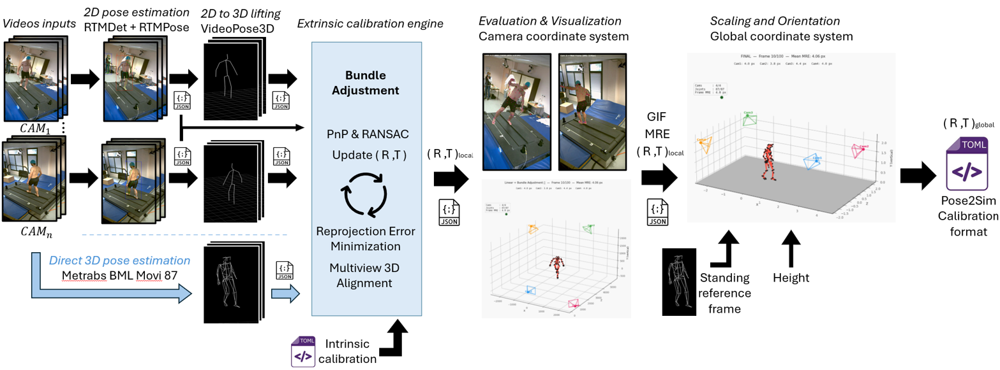

# HumanCalib

**Extrinsic multi-camera calibration from a moving person.** No checkerboard, no calibration pattern — just someone walking through the capture volume. HumanCalib uses human pose estimation to recover the relative pose of every camera in the rig.

Two pose estimation architectures are supported, with fundamentally different approaches:

- **MeTRAbs (recommended)** — Predicts **metric 3D poses directly** from each camera view in a single step. With 87 body joints from the `bml_movi_87` skeleton, it provides a rich, dense representation that yields high-quality calibrations. The per-camera 3D predictions enable **Procrustes alignment** as initialization, giving a strong starting point before bundle adjustment.
- **RTMPose + VideoPose3D** — The classic two-step approach: first detect **2D keypoints** with RTMPose, then **lift to 3D** with VideoPose3D. This uses 25 OpenPose joints (12 bones) and produces relative-scale 3D, requiring more optimization effort to converge.

In short, MeTRAbs collapses the 2D detection + 3D lifting into a **single forward pass** that outputs metric-scale 3D, while the RTMPose path requires two separate models and produces relative-scale 3D that must be rescaled during calibration.



### What the final output looks like


*Light-theme 3D viz with live overlays: mean MRE in the title, per-camera MRE values below, and a top-left card showing the running count of visible cameras, triangulated joints, and the current frame's reprojection error (color-coded green/orange/red).*

---

## Installation

| | Docker *(recommended)* | conda | pip |
|---|---|---|---|
| Full pipeline on GPU | ✓ | ✓ | — |
| Installs on the host | Docker only | a conda environment | a Python package |
| Same environment as the published results | exactly | same pinned versions | versions resolved by pip |
| Best for | running calibrations | developing, or no Docker | using the library and single steps |

All three need Linux or WSL2. The first two need an NVIDIA GPU with driver ≥ 525.

### Option A — Docker (recommended)

Nothing to install on the host besides Docker: the container runs exactly the
environment the results were validated with. Requires Docker with Compose v2
and the [NVIDIA Container Toolkit](https://docs.nvidia.com/datacenter/cloud-native/container-toolkit/latest/install-guide.html).

```bash
git clone https://github.com/flodelaplace/HumanCalib.git
cd HumanCalib
printf 'HOST_UID=%s\nHOST_GID=%s\n' "$(id -u)" "$(id -g)" > .env   # once
docker compose build
docker compose run --rm calib demo
```

The `.env` file makes the results belong to you rather than to root. The build
downloads about 2 GB and uses about 10 GB of disk; if the connection drops,
run `docker compose build` again and it resumes where it stopped. The demo then
downloads the MeTRAbs model (~708 MB) once, into a Docker volume.

**It worked if** the run ends with an MRE summary table and
`output/demo/results/Calib_scene_calibrated.toml` exists.

At start-up the container checks that it can see the GPU and load CUDA, and
refuses to fall back to CPU without saying so. `docker compose run --rm calib --help`
lists the commands; `docker compose run --rm calib shell` opens a shell inside.

### Option B — conda

```bash
git clone https://github.com/flodelaplace/HumanCalib.git
cd HumanCalib
conda env create -f envs/calib.yaml
conda activate humancalib

bash scripts/calibrate.sh demo demo/Calib_scene.toml output/demo_metrabs \
    --pose_engine metrabs --height 1.78 --ref_frame 5
```

One environment runs the whole pipeline, with every version pinned — see
`envs/calib.yaml` for why each pin is what it is. No post-install step is
needed: `scripts/calibrate.sh` runs the code straight from the checkout. To
also get the `humancalib` command, add `pip install --no-deps -e .`; `--no-deps`
keeps the exact versions of the environment instead of letting pip replace
them.

The MeTRAbs model (~1.1 GB on disk) is downloaded on the first run and cached in
`~/.cache/tfhub_modules`, which survives reboots, unlike TensorFlow Hub's default
`/tmp`. Set `TFHUB_CACHE_DIR` to put it elsewhere. The environment's CUDA
libraries, and on WSL2 the driver path (`/usr/lib/wsl/lib`), are put on the loader
path automatically.

**It worked if** the log shows `Compute device: GPU` and the run ends with an MRE
summary table.

### Option C — pip

```bash
pip install "git+https://github.com/flodelaplace/HumanCalib"
humancalib --help
```

This installs the `humancalib` package and command (Python ≥ 3.10): linear
calibration, bundle adjustment, evaluation and scaling run on a CPU, as
individual steps (`humancalib ba --prefix output/my_session`) or from Python.

What pip cannot provide is **GPU pose extraction**. TensorFlow 2.12 has no pip
variant that bundles CUDA, so running the full pipeline needs cudatoolkit 11.8
and cuDNN 8.9 from conda or Docker — use option A or B for that.

### Optional backend: RTMPose + VideoPose3D

The legacy two-step pose backend, kept for comparison. MeTRAbs is recommended
for new work. It uses Python 3.8 and PyTorch, so it lives in its own image or
environment. Its weights carry non-commercial licences — see
[Licensing](#licensing).

With Docker:

```bash
docker compose --profile rtmpose build
docker compose --profile rtmpose run --rm rtmpose demo      # results in output/demo_rtmpose/
```

With conda:

```bash
conda env create -f envs/rtmpose.yaml
conda activate humancalib-rtmpose
pip install --no-deps rtmlib==0.0.15   # --no-deps is required: see envs/rtmpose.yaml
bash scripts/setup_models.sh           # VideoPose3D source + weights, checksummed

bash scripts/calibrate.sh demo demo/Calib_scene.toml output/demo_rtmpose \
    --height 1.78 --ref_frame 5
```

### Platform support

| Platform | Status |
|---|---|
| **Linux** (Ubuntu 22.04) | Tested, fully supported |
| **Windows via WSL2** | Tested, fully supported |
| **Windows native** | Not tested — use WSL2 |
| **macOS** | Not supported (needs an NVIDIA GPU) |

Tested with an NVIDIA RTX 3500 Ada, driver 581.

---

## Calibrating your own data

### 1. Prepare a session folder

Put one folder per session under `input/`, with one synchronised video per
camera (`.mp4`, `.avi`, `.mov` or `.mkv`) and a `Calib_scene.toml` holding each
camera's intrinsics in [Pose2Sim](https://github.com/perfanalytics/pose2sim)
format:

```toml
[camera01]
name = "camera01"
size = [1920.0, 1080.0]
matrix = [[1057.46, 0.0, 942.23], [0.0, 1056.83, 535.6], [0.0, 0.0, 1.0]]
distortions = [-0.041, 0.0086, -0.0002, 0.0002]
fisheye = false
```

Video names without their extension must match the TOML sections. Cameras are
numbered in alphabetical order of those names, so pad numbers with zeros
(`camera01 … camera10`). [`input/README.md`](input/README.md) has the details,
including how to flag frames to ignore.

> **Intrinsics matter most.** Wrong focal lengths or distortion coefficients are
> the first cause of poor results; k1, k2 above about 5 in absolute value are
> almost certainly wrong.

### 2. Run

With Docker — paths inside the container are `/input/...` and `/output/...`:

```bash
docker compose run --rm calib \
    /input/my_session /input/my_session/Calib_scene.toml /output/my_session \
    --height 1.84 --ref_frame 1415
```

With conda:

```bash
bash scripts/calibrate.sh \
    input/my_session input/my_session/Calib_scene.toml output/my_session \
    --pose_engine metrabs --height 1.84 --ref_frame 1415
```

`humancalib run` takes the same arguments once the package is installed. Outside
Docker, `--pose_engine` defaults to `rtmpose` for backward compatibility, so pass
`--pose_engine metrabs`; each Docker image defaults to the backend it contains.

### 3. Main options

| Option | Default | Effect |
|---|---|---|
| `--pose_engine metrabs\|rtmpose` | see above | Pose backend |
| `--height <m>` + `--ref_frame <n>` | — | Subject height, and a frame where they stand straight: enables metric scaling and a gravity-aligned frame |
| `--start_frame <n>` / `--end_frame <n>` | whole video | Frame range to use |
| `--frame_skip <n>` | `10` | Frame subsampling for bundle adjustment; lower is denser and slower |
| `--conf_threshold <t>` | `0.5` | Minimum keypoint confidence |
| `--verbose` / `--quiet` | — | More detail, or only warnings and errors |

**Every option**, with worked examples and a guide to diagnosing a camera that
stays worse than the others: [HOWTO.md](HOWTO.md).

### 4. Results

Everything lands in `<output_dir>/results/`:

| File | Contents |
|---|---|
| `Calib_scene_calibrated.toml` | Final calibration, metric and gravity-aligned — ready for Pose2Sim, OpenCap or OpenSim |
| `3d_skeleton_FINAL.trc` | Triangulated 3D skeleton, TRC format |
| `camera/visu_3d_FINAL.gif` | 3D animation of the skeleton and cameras |
| `MRE_visualizations/` | Best and worst reprojection frame per camera |
| `ba_cost_live_iter*.png` | Bundle adjustment convergence |

Re-running on the same output folder and frame range reuses the extracted poses
and skips pose estimation. The cache checks the frame range only, not the
intrinsics: after changing the TOML, delete `<output_dir>/noise_1_0/2d_joint`
and `3d_joint` to force re-extraction.

---

## Pipeline Overview

The pipeline processes synchronized multi-camera videos in 7 steps, run in order by `humancalib run` (or `scripts/calibrate.sh`, which forwards to it). Each step can also be run on its own with `humancalib <step>`:

| Step | Module (`humancalib.…`) | `humancalib` step | Description |
|------|--------|------|-------------|
| **1. Pose Extraction** | `pose.metrabs_inference` / `pose.rtmlib_inference` | `extract-metrabs` / `extract-rtmpose` | Detect 2D keypoints (+ direct metric 3D with MeTRAbs) in all camera views |
| **2. Intrinsics Loading** | `pipeline.create_cameras_from_toml` | `cameras` | Parse camera matrices & distortion from a Pose2Sim-compatible TOML |
| **3. Session** | `pipeline.write_session` | `session` | Probe the videos (frame size and rate), count cameras and joints; write `<output>/noise_1_0/session.yaml` |
| **4. 3D Lifting** | `pose.inference` | `lift` | Lift 2D→3D with VideoPose3D *(skipped when using MeTRAbs — 3D is already available)* |
| **5. Calibration** | `pipeline.run_calib_linear` → `calibration.calib_linear` → `pipeline.detect_outlier_frames` → `pipeline.run_ba` → `calibration.ba` | `linear`, `outliers`, `ba` | Chunked linear init (Procrustes for MeTRAbs, auto reference-camera selection) → auto outlier-frame drop → linear re-run if any drops → Bundle Adjustment |
| **6. Evaluation** | `postprocessing.evaluate_calibration` | `evaluate` | Compute Mean Reprojection Error (MRE) per camera + visualizations |
| **7. Scaling** | `postprocessing.scale_scene` | `scale` | Orient scene (gravity-aligned) and scale to metric units using person height |

**Final output:** `Calib_scene_calibrated.toml` with extrinsic parameters (R, t) for each camera in a real-world metric coordinate system.

---

## Pose Engines

Two pose estimation backends are supported, with fundamentally different architectures:

### MeTRAbs (recommended) — Direct 3D in one step

[MeTRAbs](https://github.com/isarandi/metrabs) is a metric-scale 3D human pose estimator that predicts **2D and 3D poses simultaneously** in a single forward pass. Unlike the traditional two-step pipeline (2D detection → 3D lifting), MeTRAbs directly outputs **metric 3D coordinates** (in millimeters) from each camera view independently.

**Why this matters for calibration:** since each camera produces its own 3D skeleton in metric scale, we can use **Procrustes alignment** to find the relative rotation and translation between cameras directly from their 3D predictions — without needing an intermediate triangulation step. This gives a much better initialization for bundle adjustment compared to 2D-only methods.

We use the **`bml_movi_87`** skeleton (87 joints from the [BML MoVi](https://www.biomotionlab.ca/movi/) dataset). The full 87-joint 2D and 3D predictions flow through the entire calibration pipeline. For bone-length regularization in Bundle Adjustment, we use a **27-bone skeleton** built from the 26 "real" joints (head, thorax, pelvis, shoulders, elbows, wrists, hands, hips, knees, ankles, feet, heels, toes, backneck, sternum) — the other ~60 joints in `bml_movi_87` are virtual landmarks (clavicle, sternum sides, lbreast, lfirstmetatarsal, etc.) that MeTRAbs constructs as linear combinations of the 26 main joints; treating them as independent bone sources would be redundant and would make the system rank-deficient.

These **27 bones** cover the full body including a 4-segment spine and articulated feet — significantly richer than OpenPose's 12 bones. The mapping from `bml_movi_87` to the 26-joint subset is defined in `src/humancalib/core/skeletons.py` (`METRABS_BML87_INDICES`), and the bone topology in `METRABS_BONE` is remapped onto the 87-joint indices at runtime by `get_bone_config(87)`. A **Halpe26 conversion** of the 2D detections is also generated for backward compatibility with the scaling step.

**Temporal smoothing:** a Savitzky-Golay filter is applied to both 2D and 3D trajectories to reduce frame-to-frame jitter on valid detections.

| Property | Value |
|----------|-------|
| Model | `metrabs_l` (EffNetV2-L backbone) via TensorFlow Hub |
| Input skeleton | `bml_movi_87` (87 joints) |
| Stored output | Full 87-joint 2D + 3D, Halpe26 2D (for scaling) |
| 3D output | Metric (millimeters), per-camera coordinate frame |
| Architecture | Single-step: image → 2D + 3D simultaneously |
| Conda env | `humancalib` (Python 3.10, TensorFlow 2.12) — `envs/calib.yaml` |
| Speed | ~2 min/camera on GPU |

### RTMPose + VideoPose3D — Two-step 2D→3D lifting

The classic two-step path uses [RTMPose](https://github.com/Tau-J/rtmlib) (via `rtmlib`) for **2D keypoint detection** in **Halpe26** format, then [VideoPose3D](https://github.com/facebookresearch/VideoPose3D) for **temporal 2D→3D lifting**. The lifting model uses temporal context across frames to estimate 3D poses, but the output is in **relative scale** (not metric), so a scaling step is required after calibration.

This path is still fully functional and can be useful when MeTRAbs is not available or as a comparison baseline.

| Property | Value |
|----------|-------|
| 2D model | RTMPose (ONNX, via `rtmlib`) |
| 3D model | VideoPose3D (`pretrained_h36m_detectron_coco.bin`) |
| Output skeleton | 25 OpenPose joints (12 bones) |
| 3D output | Relative scale (not metric) |
| Architecture | Two-step: image → 2D keypoints → temporal 3D lifting |
| Conda env | `humancalib-rtmpose` (Python 3.8, PyTorch 1.13) — `envs/rtmpose.yaml` |

### Comparison

| | MeTRAbs | RTMPose + VP3D |
|---|---|---|
| **Architecture** | **1 step** (direct 3D per camera) | **2 steps** (2D detection + 3D lifting) |
| **Joints / Bones** | 87 full (26 calib) / 27 bones | 25 joints / 12 bones |
| **3D scale** | Metric (mm) | Relative |
| **Calibration init** | Procrustes alignment (from 3D) | Bone collinearity (from 2D) |
| Linear calibration MRE | 7.8 px | 152.2 px |
| After Bundle Adjustment | **3.5 px** | **8.5 px** |
| Scale factor | 0.001 (metric 3D in mm) | 30.9 (arbitrary units) |

*Results on demo dataset (4 cameras, 100 frames).*

---

## Bundle Adjustment: analytic Jacobian (fast, default)

Bundle Adjustment refines all camera rotations/translations and the 3D points by minimizing reprojection error (`scipy.optimize.least_squares`, TRF). The cost is dominated not by the iterations themselves (which are sequential and cannot be parallelized) but by **evaluating the Jacobian** — and by default SciPy estimates it with **finite differences**, which re-evaluates the (large) objective many times per iteration.

The pipeline instead supplies an **exact analytic Jacobian** (`src/humancalib/calibration/ba_jacobian.py`), enabled by default (`--ba_jac analytic`):

- **Reprojection term** — analytic, via the projection derivative composed with the Rodrigues derivative (`cv2.Rodrigues` supplies ∂R/∂rvec).
- **Bone-length variance term** — analytic.
- **Cross-camera direction-variance term** — finite-differenced over the 3·C rotation-vector parameters only (negligible cost, exact to step precision).

This removes the finite-difference eval explosion — **~10–100× fewer objective evaluations for identical accuracy**. On the demo, numeric vs analytic gave the same MRE (4.057 vs 4.058 px) while the objective was evaluated **~2940 vs ~22 times**. Validated against a numeric Jacobian (max relative error ~1e-9).

Use `--ba_jac numeric` to fall back to the legacy finite-difference path (same result, slower). See also the optional robust-BA flags (`--ba_loss`, `--ba_obs_weight`, `--ba_f_scale`) in `src/humancalib/argument.py`, which are **off by default** and preserve the current behavior unless explicitly enabled.

---

## Technical details

### Linear Calibration

**Linear calibration** (`src/humancalib/calibration/calib_linear.py` orchestrated by `src/humancalib/pipeline/run_calib_linear.py`) computes initial extrinsic parameters. The approach differs significantly depending on the pose engine:

**With MeTRAbs — Procrustes alignment:**
Since MeTRAbs gives a metric 3D skeleton per camera, we can directly align skeletons between cameras using [Procrustes analysis](https://en.wikipedia.org/wiki/Procrustes_analysis) (Umeyama method). One camera defines the world frame; for each other camera, the algorithm finds R, t, s that align its 3D skeleton to the reference. The per-camera 3D is already in metric scale, so the Procrustes residual is typically a few mm and gives a strong starting point for BA. Triggered automatically for the 26-joint and 87-joint MeTRAbs skeletons. The 87-joint skeleton uses a remapped subset of the 27 "real" bones (`METRABS_BONE` mapped onto 87-joint indices) — the ~60 virtual joints in `bml_movi_87` are linear combinations of the 26 main joints inside MeTRAbs' regression head and would otherwise produce rank-deficient orientation constraints.

**Auto reference-camera selection:** by default the reference is **picked automatically** by trying every camera as candidate and keeping the one that minimises the mean Procrustes residual across the other (C-1) alignments. The reference camera's noise propagates to all relative R/t estimates, so a clean view (good angle on the subject, low joint occlusion) yields a markedly better init. Override with `--ref_cam <CAM_ID>` if you want to pin a specific camera. The cost of auto-selection is negligible (just C extra Procrustes alignments, no triangulation).

**With RTMPose — Collinearity constraints:**
Uses bone orientation collinearity and coplanarity constraints from 2D projections (original method from the paper). This requires solving a larger linear system and doesn't benefit from metric 3D data, so the initial MRE is much higher.

**Chunk-based processing** (`src/humancalib/pipeline/run_calib_linear.py`):
- Data is split into chunks of **1000 frames**
- Each chunk is independently calibrated (with its own visibility filter and Procrustes/linear solve)
- All chunks are evaluated by MRE using `evaluate_calibration.py`
- The chunk with the **lowest MRE** is selected as the final linear calibration result

**Visibility filter**: within each chunk, only frames where the person is visible from >= 2/3 of cameras (rounded up) are used. Falls back to >= 2 cameras if too few frames pass the stricter threshold.

### Auto Outlier-Frame Drop (between linear and BA)

After the linear init, `src/humancalib/pipeline/detect_outlier_frames.py` runs once to flag per-camera outlier frames whose mean reprojection error exceeds **both** an absolute threshold (`--outlier_abs_px`, default 50 px) **and** a relative one (`--outlier_x_median * median`, default 5×). Typical targets: half-image / encoding-corrupted frames where MeTRAbs still produces a plausible-looking detection that conf-threshold filters can't reject.

For each affected camera the script:
1. Appends the absolute frame indices to the per-video sidecar `<video>.dropped.json` (creating it if needed; pre-existing entries are preserved).
2. Zeros the `score` and `pose` fields of those frames in the saved 2D/3D JSONs in-place, so an immediate re-run of the linear calibration sees them as drops without re-extracting MeTRAbs poses.
3. The linear calibration is automatically re-run on the cleaned data before BA proceeds (one extra pass, no additional pose extraction).

Disable with `--no_auto_outlier_drop`. The sidecars also feed the next MeTRAbs extraction (see *MeTRAbs Sidecars* below), making the drops persistent across re-runs.

### Bundle Adjustment

**Bundle Adjustment** (`ba.py`) refines the extrinsics by jointly minimizing a composite cost function with `scipy.least_squares` using the **Trust Region Reflective (TRF)** method:

1. **NLL** — weighted 2D reprojection error (main objective, confidence-weighted)
2. **var3d** — bone direction consistency across cameras (weighted by lambda1)
3. **varbone** — bone length variance across frames (weighted by lambda2, regularizer)

A fourth term, **multiview3d** (penalizing divergence between per-camera 3D and triangulated 3D), is defined but **disabled** — the per-camera 3D from MeTRAbs is too noisy frame-to-frame and conflicts with the 2D reprojection objective, degrading results.

Key BA features:
- **Auto-balanced lambda2**: at each iteration, lambda2 is recomputed so that the bone term contributes ~10% of the NLL energy (`target_ratio = 0.1`). When bone variance is negligible (< 1e-3, common with MeTRAbs metric 3D), lambda2 is set to **0** to avoid wasting optimization time. Lambda2 is also capped at 1000 to prevent extreme values.
- **Jacobian sparsity**: a sparse Jacobian structure (`build_jac_sparsity`) is provided to `scipy.least_squares`, encoding which parameters affect which residuals. This avoids full dense finite-difference computation, giving **50–200x speedup**.
- **Live convergence plot**: a PNG is saved every 10s showing the cost reduction curve with log-scale Y axis.
- **2-pass optimization**: after the first pass, frames with per-frame reprojection error > **2x median** are removed as outliers, then a second pass runs on the cleaned data.
- **Convergence**: uses `ftol=xtol=gtol=1e-7` with dynamic `max_nfev` scaled by problem size (60k–80k evaluations).
- **OOM auto-retry** (`src/humancalib/pipeline/run_ba.py`): if BA fails (e.g., out of memory), the runner automatically retries with `frame_skip += 5`, up to a maximum of 60, reducing the number of frames until BA fits in memory.

### MeTRAbs Quality Filtering and Processing

The MeTRAbs inference applies several quality filters before saving keypoints:

| Filter | Threshold | Effect |
|--------|-----------|--------|
| Dark/black frames | mean brightness < 15 | Detection set to None (conf=0) |
| Small bounding box | area < 0.5% of image | Rejected as false positive |
| Collapsed skeleton | 2D spread < 20px | Rejected (all joints in same spot) |
| Out-of-bounds joints | < 10px from image edge | 2D confidence reduced to × 0.1 |

The 3D confidence (`s3d`) uses the bounding box confidence only (not affected by OOB penalty), since MeTRAbs predicts full-body 3D even when 2D joints are clipped at the image edge.

**MeTRAbs sidecars (`<video>.dropped.json`)**: alongside each input video, an optional JSON sidecar may list frame indices that should be treated as drops by every step of the pipeline:

```json
{ "dropped_frame_indices": [1273, 1274, 1825] }
```

These indices are honored authoritatively by MeTRAbs (the matching frames get `score=0` in the saved 2D/3D JSONs) and by the calibration / BA / evaluation steps (zero confidence ⇒ ignored). The sidecar is the persistent record produced by the auto outlier-frame drop step; you can also hand-edit it to flag known black/encoded-corrupted frames before the first MeTRAbs run. Indices are absolute video frame numbers.

After filtering, a **Savitzky-Golay temporal smoothing** is applied to both 2D and 3D trajectories, reducing frame-to-frame jitter while preserving motion dynamics. Only frames with valid detections are smoothed.

**Output directories** created by MeTRAbs inference:

| Directory | Content |
|-----------|---------|
| `2d_joint/` | Full 87-joint `bml_movi_87` 2D poses |
| `3d_joint/` | Full 87-joint `bml_movi_87` 3D poses (metric, mm) |
| `2d_joint_halpe26/` | Halpe26-format 2D poses (for scaling compatibility) |

### Joint and Bone Definitions

**MeTRAbs calib-26** (26 joints, 27 bones):

```
              head (0)
               |
           backneck (1)
               |
            thor (2) ── sternum (3)
           / | \
      lsho(6) |  rsho(7)         Shoulder width: lsho ─── rsho
        |     |     |
     lelb(8) pelv(4) relb(9)
        |   / | \    |
    lwri(10) | mhip(5) rwri(11)
        |  lhip(14) rhip(15)  |   Hip width: lhip ─── rhip
    lhan(12) |       | rhan(13)
          lkne(16)  rkne(17)
            |        |
          lank(18)  rank(19)
          / |        | \
    lhee(22) lfoo(20) rfoo(21) rhee(23)
       |                        |
    ltoe(24)                 rtoe(25)
```

The 26 joints are extracted from `bml_movi_87` using `METRABS_BML87_INDICES` (defined in `src/humancalib/core/skeletons.py`).

**RTMPose / OpenPose-25** (25 joints, 12 bones):
Standard OpenPose body-25 format with joints: Nose, Neck, RShoulder, RElbow, RWrist, LShoulder, LElbow, LWrist, MidHip, RHip, RKnee, RAnkle, LHip, LKnee, LAnkle, REye, LEye, REar, LEar, LBigToe, LSmallToe, LHeel, RBigToe, RSmallToe, RHeel.

### Scaling and Orientation

Step 7 (`scale_scene.py`) transforms the calibrated scene into a metric, gravity-aligned coordinate system:

1. **Ground plane**: fitted from foot keypoints (heels, toes, feet centers, and fifth metatarsals when available)
2. **Vertical axis (Y)**: defined by head-to-feet vector (Y points down in OpenCV convention)
3. **Horizontal axis (X)**: defined by left-heel → right-heel direction
4. **Origin**: center of heels at ground level
5. **Scale**: computed from `measured_skeleton_height / real_person_height`

The joint format is **auto-detected** based on the number of joints in the 2D pose files:

| Pose engine | Joints | Foot keypoints for ground plane | Joint source |
|-------------|--------|---------------------------------|--------------|
| MeTRAbs (87 joints detected) | `bml_movi_87` | **8 points**: heels, toes, foot centers, fifth metatarsals | `2d_joint/` |
| MeTRAbs (26 joints detected) | `calib-26` | **6 points**: heels, toes, foot centers | `2d_joint/` |
| RTMPose | Halpe26 | **6 points**: heels, big toes, small toes | `2d_joint_halpe26/` |

---

## Licensing

**HumanCalib's code is MIT. The pretrained pose models it relies on are not
free for commercial use** — and that holds for the default backend too.

| Component | Licence | Applies to |
|---|---|---|
| HumanCalib | MIT ([`LICENSE`](LICENSE)) | all code in this repository |
| MeTRAbs code | MIT | the pose model's reference implementation |
| **MeTRAbs pretrained model** (`metrabs_l`) | **Non-commercial use only.** In the words of the MeTRAbs README: *"The models can only be used for non-commercial purposes due to the licensing of the used training datasets."* | every calibration made with `--pose_engine metrabs`, the recommended default path |
| VideoPose3D code and weights | CC BY-NC 4.0; weights trained on Human3.6M (academic use) | the optional RTMPose path only |
| rtmlib | Apache-2.0. Its README does not state the licence of the RTMPose/RTMDet weights it downloads. | the optional RTMPose path only |

In practice, whichever pose backend you choose, the pretrained weights restrict
use to non-commercial purposes. The Docker images contain no MeTRAbs weights
unless built with `BAKE_MODELS=1`; the optional `rtmpose` image does contain the
VideoPose3D weights. This section summarises upstream terms and is not legal
advice: check the upstream licences for your use.

---

## Project structure

```
HumanCalib/
├── pyproject.toml            # Package metadata — `pip install -e .`
├── CITATION.cff              # How to cite HumanCalib
├── CONTRIBUTING.md           # Setup, tests and conventions for contributors
├── Dockerfile                # Main image (MeTRAbs backend, MIT)
├── Dockerfile.rtmpose        # Optional image (RTMPose + VideoPose3D, CC BY-NC 4.0)
├── compose.yaml
│
├── src/humancalib/           # The Python package
│   ├── cli.py                # The `humancalib` command: `run` and each step
│   ├── argument.py           # Options shared by the linear and BA steps
│   ├── core/                 # Skeletons, geometry (DLT triangulation), pose/camera IO,
│   │                         #   session file, dropped-frame sidecars, TOML loading
│   ├── pose/                 # MeTRAbs extraction; RTMPose 2D + VideoPose3D lifting
│   ├── calibration/          # Linear init (Procrustes) and bundle adjustment,
│   │                         #   with its analytic Jacobian
│   ├── postprocessing/       # MRE evaluation, metric scaling, visualisation
│   ├── pipeline/             # The steps calibrate.sh runs, in order; each is also
│   │                         #   `python -m humancalib.pipeline.<step>`
│   └── tools/                # Standalone utilities, outside the pipeline
│
├── scripts/
│   ├── calibrate.sh          # Compatibility shim → `humancalib run`
│   └── setup_models.sh       # VideoPose3D checkout + weights (optional backend only)
│
├── envs/                     # Exact, validated environments: calib, rtmpose, ci
├── docker/entrypoint.sh      # Container entry point, with GPU / mount preflight checks
├── tests/                    # pytest suite; frozen poses run the calibration on a CPU
├── docs/REFACTOR_PLAN.md     # Reproducibility refactor: decisions, findings, status
├── demo/                     # Demo dataset (4 cameras, 100 frames)
├── input/                    # Place your calibration sessions here
├── output/                   # Calibration results
└── third_party/              # VideoPose3D checkout, created by setup_models.sh
```

> The pipeline is an installable package. `scripts/calibrate.sh` resolves its
> own location and puts `src/` on `PYTHONPATH`, so a fresh clone runs from any
> working directory without installing anything. Once installed
> (`pip install -e .`), every step is importable and runnable as a module, e.g.
> `python -m humancalib.pipeline.run_ba --help`.

---

## Troubleshooting

| Problem | Cause | Solution |
|---------|-------|----------|
| `libcuda.so not found` | WSL2 missing CUDA path | `export LD_LIBRARY_PATH=/usr/lib/wsl/lib:$LD_LIBRARY_PATH` (added automatically by `humancalib run`) |
| High MRE on one camera | Bad intrinsics (distortion) | Check distortion coefficients: k1/k2 should be in [-2, 2]. Values > 5 are likely wrong. |
| BA makes MRE worse | Regularization too strong | Auto-balanced lambda should handle this. If not, check if `objfun_multiview3d` is disabled. |
| `No valid orientations` | Too few visible frames | Lower `--conf_threshold` or use a different frame range where person is more visible. |
| MeTRAbs import error | TensorFlow not in the environment | MeTRAbs runs in the current environment, or in a `metrabs_opensim` conda environment if one exists. Set `HUMANCALIB_METRABS_PYTHON` to an interpreter command line to choose explicitly. |
| OOM during BA | Too many frames | `humancalib.pipeline.run_ba` auto-retries with `frame_skip += 5` (up to max 60) to reduce memory usage. |
| Poses not re-extracted | Cache hit | Delete `output/*/noise_1_0/2d_joint` and `3d_joint` to force re-extraction (the cache only checks frame range, not intrinsics). |
| Same intrinsics work better than individual ones | Poor per-camera calibration | If cameras are the same model, try shared intrinsics as baseline. |
| One camera much higher MRE than others | Wrong intrinsics for that camera | Look at its Procrustes residual in the linear log — if it's low (≤ 100 mm) but its MRE is high, the K matrix (focal/principal point) is the bottleneck. The auto reference-camera selection avoids using a problematic camera as world frame. |
| Half-image / corrupted frames inflate MRE | Encoding artifacts | Auto outlier-frame drop catches these; sidecar `<video>.dropped.json` files are written automatically under `<output_dir>/noise_1_0/dropped_frames/`. To pre-flag known frames, hand-edit the sidecar before the first run. |
| `could not select device driver "" with capabilities: [[gpu]]` | NVIDIA Container Toolkit missing | Install it, then restart the Docker daemon. |
| `error getting credentials ... docker-credential-desktop.exe: exec format error` | WSL: Docker Desktop's credential helper cannot run from Linux | Remove the `"credsStore": "desktop.exe"` line from `~/.docker/config.json` (or point `DOCKER_CONFIG` at a folder with an empty `config.json`). |
| `Timeout was reached` during `docker compose build` | Slow or unstable connection | Run `docker compose build` again: downloads resume where they stopped. |
| `ERROR: /output is not writable by uid ...` | `output/` owned by another user, e.g. root after an earlier run | Create `.env` as in [Option A](#option-a--docker-recommended), or fix the ownership of `output/`. |
| `ERROR: this container can see a GPU, but cannot load the CUDA runtime` | `LD_LIBRARY_PATH` overridden at run time | Append to it instead of replacing it; the message shows the value to use. |
| `the RTMPose backend is not installed in this environment` | `--pose_engine rtmpose` (the native default) without that backend | Pass `--pose_engine metrabs`, or use the RTMPose image or environment. |

---

## Acknowledgments & Citations

Citation metadata for HumanCalib itself is in [`CITATION.cff`](CITATION.cff); GitHub
turns it into a *Cite this repository* button.

This project builds upon [Extrinsic Camera Calibration From a Moving Person](https://github.com/kyotovision-public/extrinsic-camera-calibration-from-a-moving-person) (IROS 2022 / RA-L):

```bibtex
@ARTICLE{9834083,
  author={Lee, Sang-Eun and Shibata, Keisuke and Nonaka, Soma and Nobuhara, Shohei and Nishino, Ko},
  journal={IEEE Robotics and Automation Letters},
  title={Extrinsic Camera Calibration From a Moving Person},
  year={2022},
  volume={7},
  number={4},
  pages={10344--10351},
  doi={10.1109/LRA.2022.3192629}}
```

**MeTRAbs** — Metric-Scale Truncation-Robust Heatmaps for Absolute 3D Human Pose Estimation,
by István Sárándi, Timm Linder, Kai O. Arras and Bastian Leibe (IEEE T-BIOM, 2021). HumanCalib uses the official `metrabs_l` model, loaded
unmodified from the authors' server via TensorFlow Hub.
- [github.com/isarandi/metrabs](https://github.com/isarandi/metrabs)
- Companion project by the maintainer of HumanCalib, not a dependency:
  [Metrabs_to_Opensim](https://github.com/flodelaplace/Metrabs_to_Opensim) — a companion
  single-camera MeTRAbs → OpenSim pipeline.

**RTMPose** — Real-Time Multi-Person Pose Estimation:
- [RTMLib](https://github.com/Tau-J/rtmlib) — Part of the [MMPose](https://github.com/open-mmlab/mmpose) ecosystem

**VideoPose3D** — 3D Human Pose Estimation in Video:
- [github.com/facebookresearch/VideoPose3D](https://github.com/facebookresearch/VideoPose3D)

---

## Contributing

See [`CONTRIBUTING.md`](CONTRIBUTING.md) for the development setup, the test suite
and the conventions. The decisions and findings behind the current structure of
the repository are recorded in [`docs/REFACTOR_PLAN.md`](docs/REFACTOR_PLAN.md).
